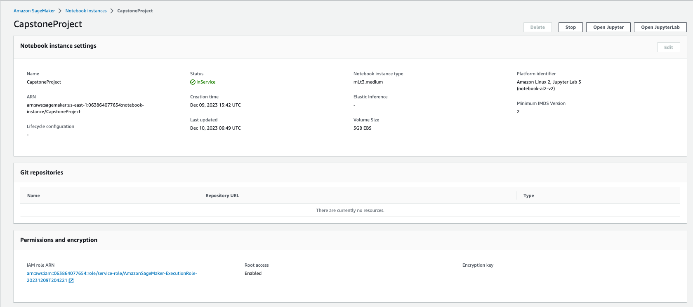
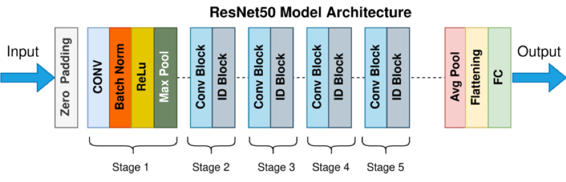
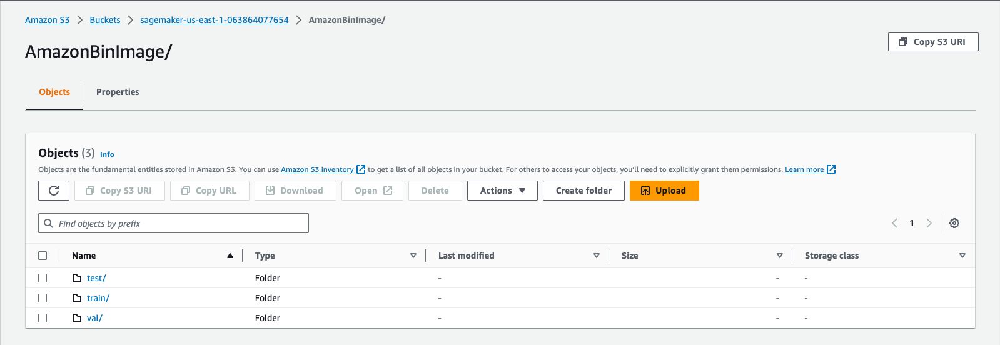
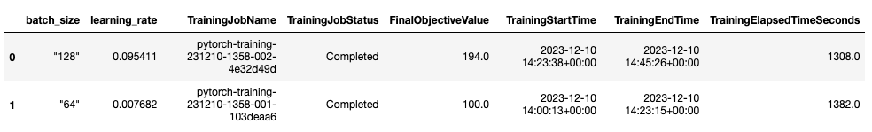
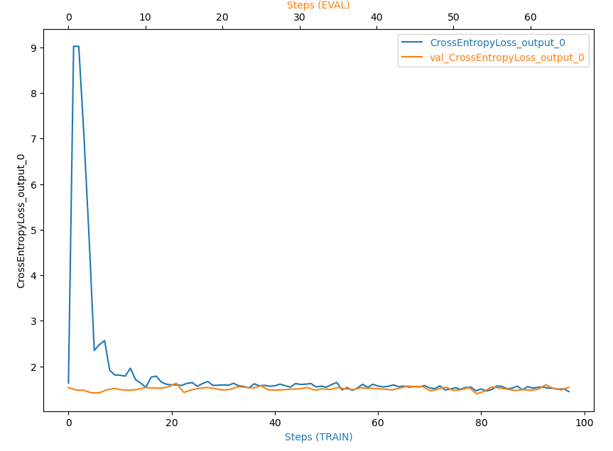
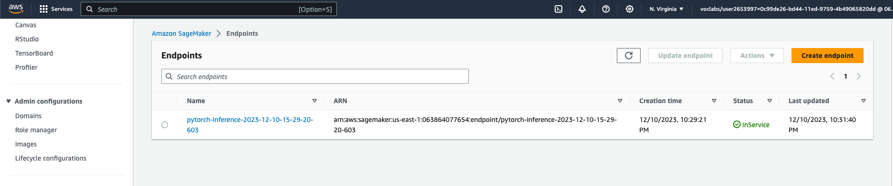

# INVENTORY MONITORING AT DISTRIBUTION CENTERS

Robots are used in distribution centers for moving objects as a part of their operations and those objects which are carried in bins can consist of a lot of objects. In this project, we are addressing the problem of inventory monitoring at distribution centers by developing a Deep Learning (DL) model that is capble of automatically counting the number of objects in bins and, thus, providing accurate inventory tracking information to decision makers for optimizing their operations.

To develop this Capstone Project, I am going to use AWS SageMaker to develop an end-to-end solution from obtaining a public dataset from its database to training and deploying a DL model using the dataset. 

## Project Set Up and Installation
I recommend that you create a SageMaker Notebook instance using `ml.t3.medium` instance and `Amazon Linux 2, Jupyter Lab 3` platform as below:



My SageMaker Notebook is linked to my public Github Repo of this Capstone Project: https://github.com/hoang-phuong-nguyen/nd009t-capstone-starter

## Dataset

### Overview
In this Project, the [Amazon Image Bin Dataset](https://registry.opendata.aws/amazon-bin-imagery/) will be used in this Capstone Project. This dataset contains more than 500K images (in JPEG format) and their corresponding labels  (in JSON format) collected from bins of a pod in an operating Amazon Fulfillment Center.

Images are located in the bin-images directory while the corresponding labels are located in the metadata directory. For example, the metadata for the image at https://aft-vbi-pds.s3.amazonaws.com/bin-images/523.jpg is found at https://aft-vbi-pds.s3.amazonaws.com/metadata/523.json


### Access
The data can be accessed by using the below command line with no AWS account required:
```
aws s3 ls --no-sign-request s3://aft-vbi-pds/
```

## Model Training
In this Capstone Project, I have employed and fine-tuned a pretrained ResNet-50 with 50 layers deep (below figure) for detecting objects in the images. 



Hyperparameters

Evaluate the performance of the model

## Machine Learning Pipeline
To summarize, the ML workflow in the Capstone Project is developed with 3 main steps as below:

###1. Data Preparations:
- [Amazon Image Bin Dataset](https://registry.opendata.aws/amazon-bin-imagery/) is fetched from the database `s3://aft-vbi-pds/`.
- The dataset is split into training, validation and test sets, which are used to fine tune the model in the next step. The split ratio is 60% train, 20% validation and 20% test.
- The data after preprocessing are uploaed to AWS S3.



###2. Model Training:
- Amazon SageMaker is used to fine tune a pretrained ResNet-50 CNN model. 
- SageMaker Hyperparameter Tuner is used to optimize the model hyperparameters during the fine tuning process.

**Hyperparameter search space**
```
hyperparameter_ranges = {
    "learning_rate": ContinuousParameter(0.001, 0.1),
    "batch_size": CategoricalParameter([32, 64, 128, 256, 512]),
}
``` 

**Hyperparameter optimization result**

```
Optimal hyperparameters: {'batch_size': 64, 'learning_rate': '0.007682083391454922'}
```


- SageMaker Debugger and Profiler are also applied to detect any anomaly while training the model.
**Training debugging**


**Profiler**: more details on the profiler report can be found in [profiler-report.html](./ProfilerReport/profiler-output/profiler-report.html)

###3. Deploy:
- The fine tuned model with the optimal hyperparameters is then deployed to a SageMaker Endpoint for further testing. 


